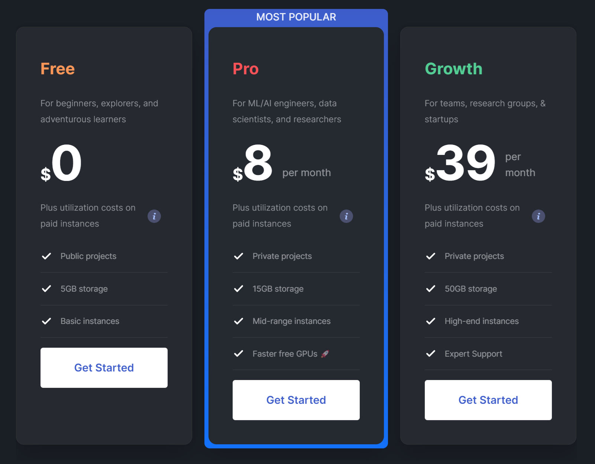

# Paperspace
[find this notebook here (paperspace login required)](https://console.paperspace.com/crimson206/notebook/rhoawtbdcdjnaoo?file=%2FMotivation.ipynb)

Paperspace offers a generous GPU renting service that is particularly beneficial for individuals and organizations with budget constraints. Their pricing structure includes three main tiers:

- **Free Tier**: Offers access to lower-end GPUs at no cost, although these GPUs are frequently out of capacity due to high demand.

- **Pro Tier**: Subscribers get access to a range of GPUs from free to good quality. However, availability can sometimes be an issue even for these enhanced options.

- **Growth Tier**: This subscription tier provides access to high-end GPUs, including the A100-80G. While the A100-80G often reaches full capacity, subscribers still have guaranteed access to a selection of GPUs ranging from the A4000 to the A6000 series.

For those concerned about the cost of GPU resources for their studies or research, Paperspace's subscription plans offer a viable solution to access powerful computing resources.



For detailed pricing information and to select a plan that suits your needs, you can visit their [pricing page](https://www.paperspace.com/pricing).


## Limitations of Paperspace

While Paperspace provides excellent GPU access, it comes with some limitations:

- The platform's environment is primarily based on Jupyter notebooks, which may not suit all development needs.
- Paperspace's Jupyter notebook instances are created by pulling a Docker image. This means users operate within a Docker environment rather than on a physical or virtual machine directly, which can introduce some limitations. For more traditional machine access, Paperspace recommends using their "Core" service.

# OpenAI Remote Endpoint

The utilization of public models and the development of open-source projects, such as Autogen, based on the OpenAI API, underscore the API's performance capabilities. However, for researchers and developers seeking diversity in models and more autonomy in their projects, several points are highlighted:

1. **Cost**: Using the OpenAI API, especially for projects involving autonomous agents like Autogen and AutoGPT, can be expensive.
2. **Diversity**: Access to a variety of public models enriches projects by providing more options and potential.
3. **Uncensored Models**: OpenAI does not provide access to uncensored models, which may be a limitation for some projects.

## Better Development Environment

The need for a better development environment is evident, as most cloud services focus on providing computational resources rather than tailored development environments. Services like Google Cloud, AWS, and Paperspace (highly recommended) offer robust cloud solutions but may not meet all the needs of developers accustomed to working in specific IDEs.

In the context of the Augogen project, for example, default models like gpt3.5 or gpt4 can be configured to use alternative models through a `config.yaml` file (example is below). This setup allows projects to mimic OpenAI model names, facilitating the use of notebook examples or tests initially designed for OpenAI models with different underlying models, as shown in the YAML configuration example.

This approach offers flexibility and cost-efficiency, enabling developers to leverage powerful models while maintaining control over their development environment and costs.

```yaml
model_list:
  - model_name: gpt-4
    litellm_params:
      model: ollama/llama2:13b
  - model_name: gpt-3.5-turbo
   litellm_params:
     model: ollama/llama2:70b
```