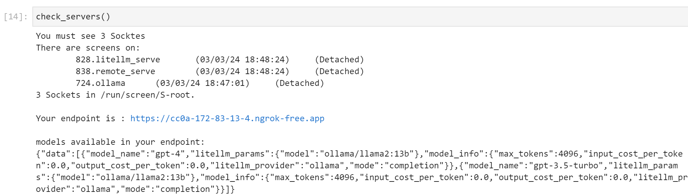

# OpenAI proxy shortcut.

Paperspace is a cloud service platform, and they provide very nice subscription plans for GPU access.

We will generate an chatbot(llm) endpoint using their gradient notebook service.

## Instruction

1. Initiation.
  - Visit [Paperspace](https://www.paperspace.com/) and log in
  - Go to your [paperspace console](https://console.paperspace.com/)
  - Create a project with a free machine if any one is available
  - If you opened the notebook, click the terminal button in the left-side panel
  - execute 'git clone https://github.com/crimson206/openai_proxy_shortcut.git' in the terminal
  - Go to openai_proxy_shortcut/oneclick, and open openai_proxy_oneclick.ipynb
  - Run all the cells

2. Reuse.
  - Open the notebook in [paperspace console](https://console.paperspace.com/)
  - Just run the openai_proxy_oneclick.ipynb again

3. Where to test.
  - Visit a simple chatbot example, https://base-interface.streamlit.app/
  - fill the Base URL block with your openai-proxy-shortcut endpoint

## Where do I find my url?

If you run the '
openai_proxy_oneclick.ipynb' successfully, you will see a picture like below.

## Further Discussion

Currently, I set it to use models via [Ollama](https://ollama.com/). I am satisfied the number of [models](https://ollama.com/library) they provide. If there are demand for the public models from [Huggingface](https://huggingface.co/models?pipeline_tag=text-generation&sort=trending), I will implement them as well.

This is not a service that I want to develop as an app or library, but it is just to share my GPU access experience with you. Therefore, I won't implement any fancy functionalities.

I am still willing to expand the variation of the models, and add example notebooks. Or, I can even publish it as a package.

If you encounter some problems, report it in [Issue tap](https://github.com/crimson206/openai_proxy_shortcut/issues).
If you have any idea, please share them in [Discussion tap](https://github.com/crimson206/openai_proxy_shortcut/discussions)